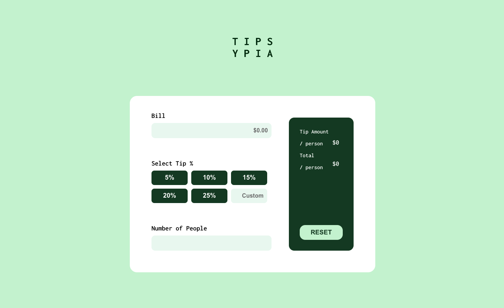
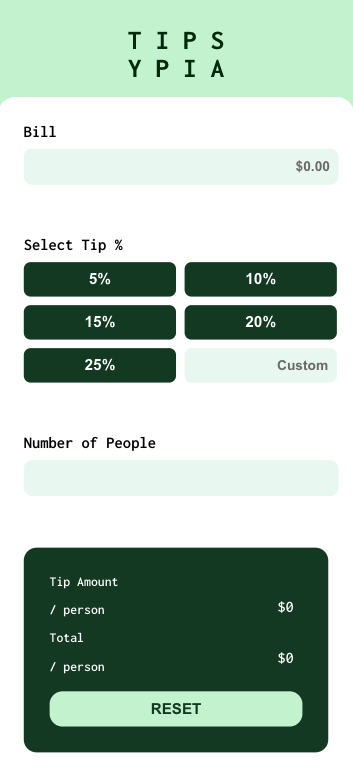

# Tip calculator app

Inspired by [Tip calculator app challenge on Frontend Mentor](https://www.frontendmentor.io/challenges/tip-calculator-app-ugJNGbJUX). 

## Table of contents

- [Overview](#overview)
  - [The challenge](#the-challenge)
  - [Screenshot](#screenshot)
  - [Links](#links)
- [My process](#my-process)
  - [Built with](#built-with)
  - [What I learned](#what-i-learned)
  - [Continued development](#continued-development)
  - [Useful resources](#useful-resources)
- [Author](#author)

## Overview
Heroku: https://tipsypia.herokuapp.com/
### The challenge

Users should be able to:

- View the optimal layout for the app depending on their device's screen size
- See hover states for all interactive elements on the page
- Calculate the correct tip and total cost of the bill per person

### Screenshot
Desktop 

Mobile

## My process

### Built with

- Flexbox
- CSS Grid
- Mobile-first workflow
- [React](https://reactjs.org/) - JS library

### What I learned

1. React Functional Components.
2. UseState Hook.
3. State and Props.
4. Javascript conditional (ternary) operator.
5. isNaN function.
6. CSS Grid. 
7. Mobile first design approach.

### Continued development

I have learnt so much after this project, however, there are still concepts that I am still not completely comfortable with. Areas I'd like to continue focusing on in future projects:

1. CSS Grid.
2. Refine on useState Hook, State and Props.
3. More organized approach for styling different components and media query.

### Useful resources

- [Dev Ed Youtube Chanel](https://www.youtube.com/watch?v=dMH1_YtUTSQ) - This helped me learn about State and Props. Ed is an amazing teacher! I'd recommend this channel for anyone still learning this concept.

## Author

- Twitter - [@mia_tran92](https://www.twitter.com/mia_tran92)
